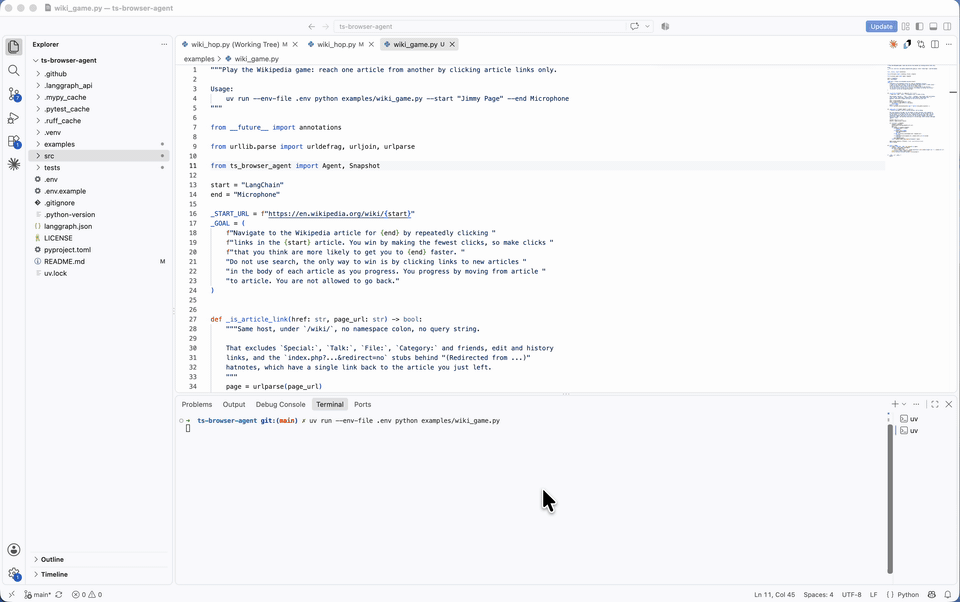

# ts-browser-agent

A fast browser agent built on
[`langchain-typesafe`](https://docs.langchain.com/oss/python/integrations/providers/typesafe)
and the LangChain SDK. No third-party browser-agent package.
<a href="docs/wiki_game.mp4"></a>

## Quickstart: run it in LangSmith Studio

1. Install:

   ```bash
   uv sync
   uv run playwright install chromium
   ```

2. Add a `.env` based on `.env.example` and fill in your values.
3. Start the dev server:

   ```bash
   uv run langgraph dev --allow-blocking
   ```

4. Type a goal. The deep agent plans, hands each page to the `browse_fast` tool, and
   reports back. Each call opens a visible Chromium.

   > Go to https://en.wikipedia.org/wiki/Main_Page and open the article about the
   > Rosetta Stone. Tell me its first sentence.

   > Search Google Flights for round-trip flights from Montreal to Cancún, departing
   > 2027-01-15 and returning 2027-01-22, one adult in economy. Tell me the cheapest
   > price shown.

   Use concrete dates and places; the classifier cannot resolve "next month" or
   "somewhere warm". Private, loopback, and cloud-metadata addresses are blocked before
   any navigation.

## Why `langchain-typesafe`

`TypeSafeClassifier` answers categorical questions about a JSON payload in one request.
It returns probabilities over answers you offered, not generated text. A browser step
fits: which operation, and which element. Trimmed from `decision.py`:

```python
from langchain_typesafe import Choice, TypeSafeClassifier

classifier = TypeSafeClassifier(
    questions={
        "operation": Choice(
            instructions="Advance the goal from the current page using one operation.",
            criteria={"CLICK": "Click an element.", "TYPE_TEXT": "Type into a field.", "DONE": "..."},
        ),
        "click_target": Choice(
            instructions="Choose the best target if the next operation is CLICK.",
            criteria={"14": {"label": "Where to?"}, "21": {"label": "Cancún, Mexico"}},
        ),
    }
)
response = classifier.invoke({"goal": goal, "page": page, "elements": elements})
response.choices["operation"].choice            # "CLICK"
response.choices["click_target"].probabilities  # {"21": 0.91, "14": 0.09}
```


Docs: [provider guide](https://docs.langchain.com/oss/python/integrations/providers/typesafe)
· [API reference](https://reference.langchain.com/python/integrations/langchain_typesafe/)
· [TypeSafe docs](https://docs.typesafe.ai/introduction)
· [speculative fan-out pattern](https://docs.typesafe.ai/patterns/fan-out)
· [PyPI](https://pypi.org/project/langchain-typesafe/)

## Use it as a utility

The Studio graph is two importable pieces.

### Wrap `browse_fast` in your own deep agent

`make_browse_fast_tool()` returns a LangChain tool for `create_agent` or
`create_deep_agent`.

```python
from deepagents import create_deep_agent
from ts_browser_agent import make_browse_fast_tool

browse_fast = make_browse_fast_tool()  # headless=True, allow_private=False by default
agent = create_deep_agent(model="openai:gpt-5.5", tools=[browse_fast])
agent.invoke({"messages": [("user", "Find the pricing page and summarize the tiers.")]})
```

A call returns a status line plus the final page's visible text, so the caller can read
a price or a title from it. `headless`, `allow_private`, and `text_model` are fixed
when the tool is built; they are not tool arguments.

`url` comes from a model, so `ensure_navigable` checks it before any browser launches.

See `examples/deep_agent.py`.

### Drive `Agent` directly

You get the per-step trace and the final status:

```python
from ts_browser_agent import Agent

with Agent(
    "https://en.wikipedia.org/wiki/Main_Page",
    "Open the article about the Rosetta Stone.",
) as agent:
    for state in agent.run():
        print(state["step"], state["operation"], state["target"])
    print(agent.status)
```

## Examples

Every example opens a visible browser so you can watch.

| Example | Path | What it exercises |
| --- | --- | --- |
| `flight_search.py` | `Agent` | A long click/select chain on real dynamic UI (Google Flights). Search only; it never books |
| `github_issue.py` | `Agent` | Structurally different UI at each step (tab, filter, list, issue) |
| `wiki_hop.py` | `Agent` | The same decision (first link in body text) made correctly many times in a row |
| `wiki_game.py` | `Agent` | Reach one article from another (`--start`, `--end`). The game's rules are enforced by filtering each snapshot in the example: no revisits, article links only, no search |
| `deep_agent.py` | deep agent | The minimal shape: one `browse_fast` call, one page-scoped goal |

```bash
uv run --env-file .env python examples/wiki_game.py --start "Jimmy Page" --end Microphone
```

## Credits

The design follows [jev-ultrafast](https://github.com/browser-use/jev-ultrafast) by
Browser Use: one TypeSafe request per step, a small model for typed text only, no LLM
reasoning per click. The instruction text in `decision.py` is adapted from it under the
MIT license. The implementation is independent — Playwright rather than Browser
Harness, `langchain-typesafe` rather than a custom client.
